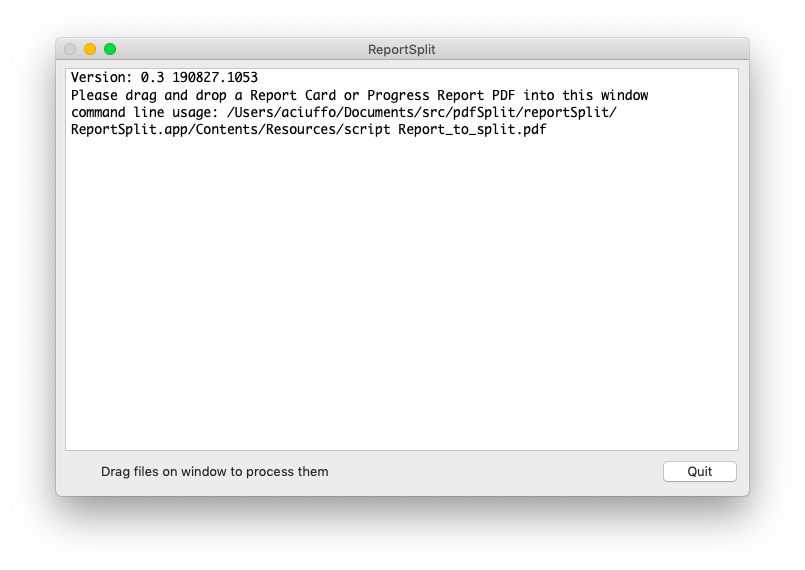

# reportSplit
split PDFs based on student information contained in PDF

Created by Aaron Ciuffo (aaron dot ciuffo) 

Released under GPLv3 
* Available at https://www.gnu.org/licenses/gpl-3.0.html 

The reportSplit.sh script takes exactly one argument that is the path to a PDF file and creates a sub directory at the same path in the format:
/split_[original_filename]/. The script then uses pdfgrep and sejda-console to
split the original PDF into individual PDFs based on internal text boundaries.

reportSplit.sh is also packaged as an OS X Platypus appliacation under the name:
reportSplit.app - this accepts a dropped PDF and can be run via the GUI.

The script searches and splits orginal PDF for the following string:
```Student: Nelson Mandella StudentID:123456```
Whitespace inside the above pattern is ignored.

### Prerequisites
* Java SE 1.8 - http://www.oracle.com/technetwork/java/javase/downloads/jdk10-downloads-4416644.html
* Sejda-Console - this is included with the script
* [Homebrew](https://brew.sh/) for installing pdfgrep
   * Homebrew can be installed using the following procedure by IT support:
  ```
  $ login admin
  $ /usr/bin/ruby -e "$(curl -fsSL https://raw.githubusercontent.com/Homebrew/install/master/install)"
  ```
* pdfgrep - provided by homebrew on OS X 
  * In managed, non sudoer environments this can be installed by it support
```
brew install pdfgrep
```
## Getting Started
* Download the zip file: [https://github.com/txoof/pdfSplit/raw/master/reportSplit.zip]

### Installing
* Open the zip file and locate the ReportSplit Application (reportSplit.app)
* Move the ReportSplit application to your Application or Documents folder
* Double click on the application
  * If your computer gives the message "“ReportSplit.app” is an application downloaded from the Internet. Are you sure you want to open it?" please choose "Open" or contact IT Support
* Drag a the ```test-report.pdf``` onto the application window. A new folder will appear in the reportSplit folder. It should contain three documents

### Normal Use
* Open the reportSplit.app and drag a PDF containing multiple student records into the window.

* Look in the same folder as the orginal PDF for a new folder containing individual reports.
[!Example After Running](./resources/exampleSplit.png)


## Authors

* **Aaron Ciuffo** - *Initial work* - [Txoof](https://github.com/txoof)

## License

This project is licensed under the GPL V3 License
